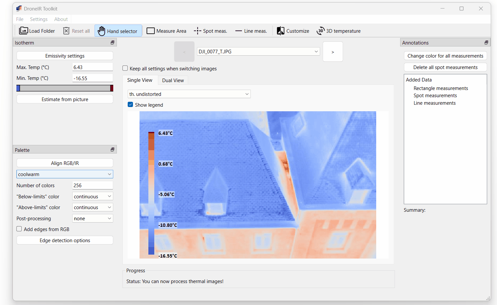

<p align="center">
    <a href=""></a>
</p>


## Overview
Thermogram is an intuitive tool designed for processing infrared (IR) images from drones. This application leverages the capabilities of multiple libraries, such as OpenCV and Pillow, and is compatible with DJI Drones. At the moment, the app includes support for Mavic 2 Enterprise and Mavic 3 Thermal series. The software features a user-friendly GUI, advanced visualization options, many processing options, and batch export possibilities

**The project is still in pre-release, so do not hesitate to send your recommendations or the bugs you encountered!**

 
    <i>GUI for thermal image processing</i>

## Features
The app offers the following key features:
- User-friendly GUI for simple measurements (spot, line or rectangle).
- Dual viewer for simultaneously inspecting RGB and IR data
- 3D-viewer for viewing temperature data as 'voxels'
- Advanced color palette options
- Advanced edge overlay possibilities
- Batch export functionality (including exporting raw data as TIFF files)

<p align="center">
    <a href=""></a>
    
    Edge overlay
</p>

<p align="center">
    <a href=""></a>
    
    3D visualization
</p>


## Files and Structure
- `resources/`: Contains essential resources for the application.
- `tools/`: Contains essential image processing logic for the application.
- `ui/`: The user interface files for the application.
- `main.py`: The main Python script for running the application.
- `dialogs.py`: Handles the dialog logic.
- `widgets.py`: Defines Pyside6 widgets and UI components.

## Topics
- Drones
- Infrared Thermography
- Inspection
- Segmentation
- Building pathologies

## Installation
1. Clone the repository:
```
git clone https://github.com/s-du/Thermogram
```

2. Navigate to the app directory:
```
cd Thermogram
```
3. (Optional) Install and activate a virtual environment

   
4. Install the required dependencies:
```
pip install -r requirements.txt
```

5. Run the app:
```
python main.py
```
## Usage
(Coming soon)

## Coming next
We plan to implement the following functionalities:
- Automatic alignment of color and infrared images
- Automatic detection of building pathologies
- Highlighting of sharp temperature increase
- Generation of reports

## Contributing
Contributions to the Thermogram App are welcome! If you find any bugs, have suggestions for new features, or would like to contribute enhancements, please follow these steps:

1. Fork the repository.
2. Create a new branch for your feature or bug fix.
3. Make the necessary changes and commit them.
4. Push your changes to your fork.
5. Submit a pull request describing your changes.
